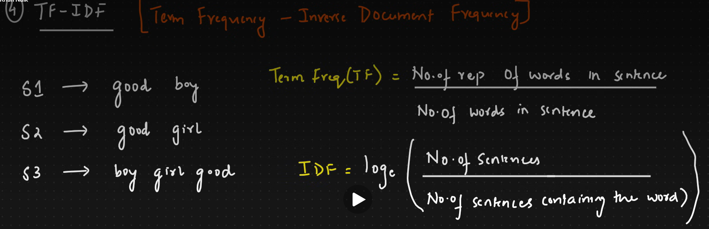

## one hot encoding

### Advantages
- Easy to implement {SLearmpmejptemcpder}
- Captures the presence or absence of a word

### Disadvantages
- Sparse metrix -> leads to overfitting
- High dimensional data
- ML algorithm need fixed size but here it is not a fixed size
- NO semantic meaning is getting captured
- Out of vocabulary (oov) words are not handled

## Bag of Words (BoW)

### Advantages
- Easy to implement
- Fixed sized vectors -> help to ML algorithms
- Captures the presence or absence of a word

### Disadvantages
- Sparse metrix -> leads to overfitting
- ordering of the word is getting changed
- NO semantic meaning is getting captured
- Out of vocabulary (oov) words are not handled

## TF-IDF (Term Frequency-Inverse Document Frequency)

### Advantages
- Easy to implement
- Fixed sized vectors -> help to ML algorithms
- Captures the presence or absence of a word

### Disadvantages
- Sparse metrix -> leads to overfitting
- ordering of the word is getting changed
- NO semantic meaning is getting captured
- Out of vocabulary (oov) words are not handled

<!--
Source - https://stackoverflow.com/a/52003495
Posted by Roman Vogt, modified by community. See post 'Timeline' for change history
Retrieved 2026-04-23, License - CC BY-SA 4.0
-->

## Word Embeddings
In natural language processing, word embeddings are a type of word representation for text analysis, typically inthe form of a real-valued vector that encodes the meaning of the word in a way that the words that are closer in the vector space are expeced to be similar in meaning

## Word2Vec
Word2Vec is a technique for learning word embeddings from text data. It is a shallow neural network that learns to predict the context of a word given the word itself, or vice versa. 

### cbow:
 -- Concept: Predict the target word using the context (surrounding words).
 **Input**: Multiple context words (e.g., "The cat ___ on the mat").
 **Output**: One target word ("sat").

### skip-gram:
 -- Concept: Predict the context words using the target word.
 **Input**: One target word ("sat").
 **Output**: Multiple context words (e.g., "The cat ___ on the mat").

- Wor2vec is 2 types, CBow(continuous bag of words) and Skip-gram
- it is good to have knowledge of ANN, LOSS, OPtimizers

### when should we go for cbow or skip-gram?
 - CBOW is for small datasets
 - Skip-gram is for large datasets
 - CBOW is faster than skip-gram
 - Skip-gram is more accurate than cbow

 ### To improve the accuracy of cbow or skip-gram
  - increase the traingin data
  - increase the window size

## Cosine Similarity
Cosine similarity is a metric used to measure the similarity between two vectors. It is defined as the cosine of the angle between the two vectors. The value of cosine similarity ranges from -1 to 1, where 1 indicates that the two vectors are identical, -1 indicates that the two vectors are diametrically opposite, and 0 indicates that the two vectors are orthogonal.